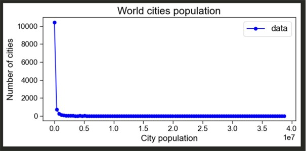

This Rmarkdown file includes an example of how to sort your code and workflow. You can then knit this document into a readable pdf, html, word etc.  
  
You can insert text, tables, figures and code in these files, whereby all can be edited.   
For example, you can use **bold** with `**bold**`, or *cursive* with `*cursive*`, etc.  
To get text on a new line, use double space at the end of the line `  `.  
  
You can insert lists as in other text editors:  
1. one  
2. two  
  
or  
  
- one  
- two  
  
or 
  
- [ ] one  
- [ ] two  
  
Now let's start with the actual document.  
  
*In the beginning you can put any prior information, e.g. description, notes, copyright note etc.*  

#  Workspace setup
First set up the workspace: Empty the environment, and set knitting options.
```{r markdown_setup, include=FALSE, echo=FALSE}
rm(list = ls())
knitr::opts_chunk$set(echo = TRUE, # Show code in the output (good for reproducibility)
                      error = FALSE # Stop rendering if there are errors
)
set.seed(100)
```

Next, install packages if necessary.
```{r install_libraries, eval=FALSE, include=FALSE}
install.packages("here")
install.packages("dplyr")
install.packages("ggplot2")
install.packages("viridis")
```

Load packages: set warning=FALSE to hide warnings.
```{r libraries, message=FALSE, warning=FALSE}
library(here)               # manage directories
library(dplyr)              # data manipulation
library(ggplot2)            # plots
library(viridis)            # colour palettes
```

Set directories (pathways to folders). We will also create a results folder.
```{r pathways}
# where are we:
getwd()

# set directories
dir_raw <- here("data", "raw_data")
dir_processed <- here("data", "processed_data")
dir_derived <- here("data", "derived_data")
dir_code <- here("code")

# Check if results folder exists, if not, create one.
if(here("results")==FALSE){
  dir.create(here("results"))
} else{
  print("Results already exists")
}
dir_results <- here("results")
```
# Process raw file

Here we will use an example of city densities as anyslsis. We wil use an example data set shown in the image:  
  
  

  
First, load the raw data:
```{r inspect_raw}
cities <- read.delim(file.path(dir_raw, "cities.txt"))
cities_vec <- cities$X39105000

# Explore
summary(cities_vec)
```

Then process and save:
```{r filter_raw}
# Filter for >10000
cities_vec <- cities_vec[cities_vec > 10000]
write.csv(cities_vec, file.path(dir_processed, "cities_filtered.csv"), 
          row.names = FALSE)
```

# Analyse processed file

## Get bins

In this example, we will bin the data and plot the histogram per bin. 


```{r, echo=FALSE, fig.show="hold", out.width="45%", fig.cap="Spaced binning: linear (left) vs log (right)."}
knitr::include_graphics(c("images/img2.jpg", "images/img3.jpg"))
```

Load the processed file:
```{r derive_densities}
# First read file
cities_filtered <- read.csv(file.path(dir_processed, "cities_filtered.csv"))
```

Then get the bins by sourcing the function. Save the Binned data set in the derived folder.
```{r bin}
# Get function to logspace
source(file.path(dir_code, "get_logspaced_bins.R"))

bins <- get_log_bins(min(cities_filtered$x), max(cities_filtered$x), n_bins = 27)

counts <- table(cut(cities_filtered$x, breaks = bins, include.lowest = TRUE, right = FALSE))

# View
as.data.frame(counts)

# Save
write.csv(counts, file.path(dir_derived, "logspaced_density.csv"),
          row.names = FALSE)
```

## Plot results
Finally, we can analyse the results by plotting. First load the necessary data sets and get the average per bin.
```{r load_derived}
densities <- read.csv(file.path(dir_derived, "logspaced_density.csv"))
str(densities)
# use custom function to get mean of each interval
densities$avg_bins <- get_interval_mean(densities$Var1)
```

Plot using the viridis palette: (when you plot make sure to put it on a new line with double spacing).  
```{r plot_densities, echo=FALSE, fig.cap="City populations histogram"}
p <- ggplot(densities, aes(x = log(avg_bins), y = log(Freq))) +
  geom_bar(stat = "identity", fill = viridis(1)) +
  labs(x = "City population (log)", y = "Frequency (log)") +
  ggtitle("City populations histogram") +
  theme_classic()
# view plot
p

```

Save the output into results.
```{r save_plot, echo=FALSE}
ggsave(file = file.path(dir_results, "cities_densities.png"), plot = p,
       width = 15, height = 10, units = "cm", dpi = 400)

